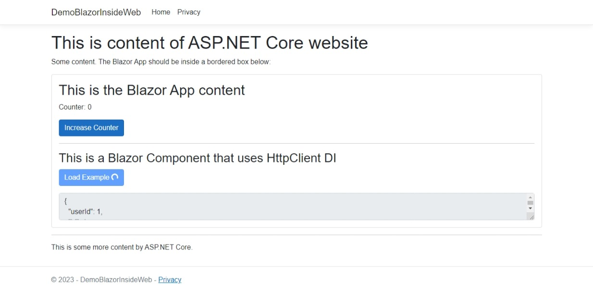

# Introduction

This repo is to solve my problem with the the following scenario:

- I already have an ASP.NET Core website (project A) https://www.example.com with many pages.

- I now want to add a page like Feature.cshtml at https://www.example.com/feature, which use Blazor (project B) has content like this:

```
<!-- Other content: header, texts, etc -->

<div id="app">
    Blazor app here
</div>

<!-- Other content: more text, footer, scripts, etc -->
```

The final result looks like this:



You can see the steps in this repo:

- At commit #2be15e3, I have an ASP.NET Core website (just a starting template). Consider this your existing website.

- [Commit #ba13eaf to 8bdae3a](https://github.com/datvm/DemoBlazorInsideWeb/compare/2be15e3e54972946b0c03aa5b18024c892066b23..8bdae3a24e9362030313495fe403907c968ac624?diff=split) adds a Blazor app to the website. You can see the changes in the commit.

# Step-by-step guide

## 1. Setup a new Blazor WebAssembly App (B)

- Create a new `Blazor WebAssembly App` project, for example `DemoBlazorInsideWeb.BlazorApp`.

- Update your router in `App.razor` to show the `Index` page for all routes:

```html
<Router AppAssembly="@typeof(App).Assembly">
    <Found Context="routeData">
        <!-- Delete everything here -->
    </Found>
    <NotFound>
        <!-- Add this here -->
        <LayoutView Layout="@typeof(MainLayout)">
            <Index />
        </LayoutView>
    </NotFound>
</Router>
```

- Optionally delete `@page` in your `Index.razor` file so no URL can ever be routed to it. This is to prevent a route accidentally match it.

- Optionally delete `index.html` file in your `wwwroot` folder. However you may want to keep the content somewhere to copy its content later.

> **Note**  
> You can still use Routing if you want to serve multiple apps on the same website (even though you have to pack all those apps inside this single project)

## 2. Setup your (existing) ASP.NET Core website (A)

- Add the Blazor project as Reference to your ASP.NET Core website project (A refers to or depends on B).

- Install `Microsoft.AspNetCore.Components.WebAssembly.Server` Nuget package:

```ps
dotnet add package Microsoft.AspNetCore.Components.WebAssembly.Server
```

- In your app startup (`Program.cs` or `Startup.cs`), add `app.UseBlazorFrameworkFiles()` before `app.UseStaticFiles()`:

```cs
app.UseBlazorFrameworkFiles();
app.UseStaticFiles();
```

- In order to debug WASM app, you need to add `inspectUri` property to your `launchSettings.json` file (you should find it in `Properties` folder). Add it to whichever profile you use, `https` and/or `IIS Express`:

```json
{
    // ...
    "IIS Express": {
        // ...
        "inspectUri": "{wsProtocol}://{url.hostname}:{url.port}/_framework/debug/ws-proxy?browser={browserInspectUri}"
    }
}
```

## 3. Setup the new web (Feature) page

In the ASP.NET Core Razor Page that you want to add the Blazor app, you need to setup Blazor's content

- Add the HTML and Javascript content:

```html
<!-- Other Razor code -->

<div id="app">
    <!-- Loading content before Blazor loads. You can copy it from index.html file -->
</div>

<div id="blazor-error-ui">
    An unhandled error has occurred.
    <a href="" class="reload">Reload</a>
    <a class="dismiss">🗙</a>
</div>

<!-- Other Razor code -->

<!-- Add the script where relevant to your project -->
<script src="_framework/blazor.webassembly.js"></script>
```

- You should also refer to the Blazor's CSS file, or simply move its content to your own ASP.NET Core project:

```html
<!-- You need to have Heads section in your Layout -->
@section Heads {
    <link rel="stylesheet" href="~/css/app.css" />
}
```